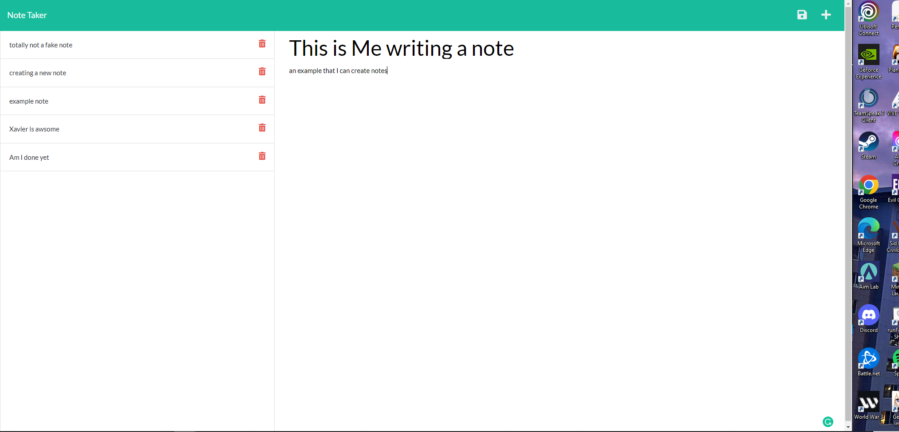

# w11-Express-NoteTaker

# Express Note Taker

## Description

Allows the user to create notes and save them to db databases as well as delete notes and uses node and Npm.

## Table of Contents

- [Installation](#installation)
- [Usage](#usage)
- [License](#license)
- [Contributing](#contributing)
- [Tests](#tests)
- [Questions](#questions)

  ## Installation

  istall Npm, Node, and uuid

  ## Usage

  to help use take notes and save them for later.

  

  ## Credits

  Xavier Marquez

  ## Tests

  node server.js

  ## License

  
  https://mit-license.org/

  ## Questions

  contact me here:

* Email: xavier.ray.marquez@gmail.com
* GitHub [XavierRayMarquez](https://github.com/XavierRayMarquez)
